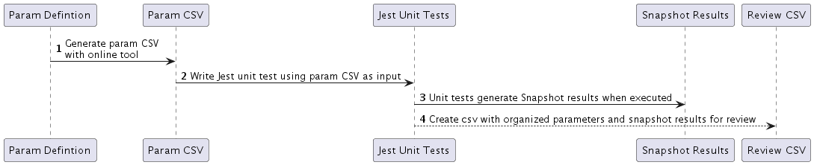
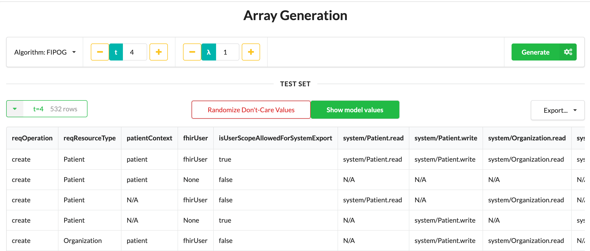

## Combinatorial Testing in SMART

### Combinatorial Testing
To learn more about combinatorial testing methodology, please check out the [NIST home page for Combinatorial Testing](https://csrc.nist.gov/projects/automated-combinatorial-testing-for-software).

### Test Creation Process
Let’s take method `verifyAccessToken` as an example to go how a combinatorial testing suite is created.


#### 1. Generate Create params definition
Analyze parameters of the methods, transform and add restrictions as needed, create params definition file in .txt. 
The definition file will be saved in [paramsDefinition/VerifyAccessToken-NoBulkDataAuth-definition.txt](paramsDefinition/VerifyAccessToken-NoBulkDataAuth-definition.txt).

#### 2. Generated Param CSV with online tool
Use [the online tool](https://matris.sba-research.org/tools/cagen/#/workspaces) to generate raw parameters file 
by uploading the .txt file to the website(See example below). The result will be saved in [params/VerifyAccessToken-NoBulkDataAuth-params.csv](params/VerifyAccessToken-NoBulkDataAuth-params.csv).


#### 3. Write the unit test :) 

#### 4. Generate csv file for review
Once the tests are ready, we need to manually review all the test cases and results. 
This requires the parameters and results to be neatly organized. So as part of the unit test, 
an output of .csv with all the input params and result will be generated if env parameter GENERATE_CSV_FOR_REVIEW 
is set to true. The generated csv file will NOT be saved in the repository so all the param and result information has 
one single source of truth. 

To generate the csv file for review run 
```shell
GENERATE_CSV_FOR_REVIEW=true yarn test
```

Tip: In the generated csv file, it could be hard to review the scope column with all the scopes clustered together, try using
the method suggested in [this post](https://stackoverflow.com/questions/14856501/substitute-a-comma-with-a-line-break-in-a-cell) to reformat each scope on different row within the cell. 

